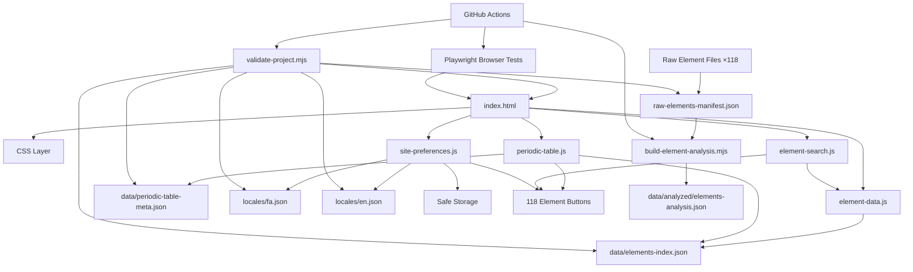

# Chemistry — Architecture & Code Audit

## 🗺️ نقشه مخزن و اتصال فایل‌ها

```text
chemistry/
├── index.html                         ← نقطه ورود UI
│   ├── styles/*.css                   ← لایه presentation
│   └── scripts/*.js                   ← runtime
│
├── scripts/
│   ├── element-data.js                ← fetch/cache داده runtime
│   │       ↓
│   ├── periodic-table.js              ← render جدول + keyboard navigation
│   │       ├── data/elements-index.json
│   │       └── data/periodic-table-meta.json
│   │
│   ├── element-search.js              ← search/combobox
│   │       └── getElementData()
│   │
│   ├── site-preferences.js             ← زبان + theme + storage
│   │       └── locales/fa.json / en.json
│   │
│   ├── validate-project.mjs            ← static/data validation
│   ├── build-element-analysis.mjs      ← تحلیل raw data
│   └── serve.mjs                       ← local test server
│
├── data/
│   ├── elements-index.json             ← canonical runtime index (118)
│   ├── periodic-table-meta.json        ← canonical layout/category metadata
│   ├── raw-elements-manifest.json      ← manifest فایل‌های raw
│   ├── ELEMENT_ATOMIC NUMBER_*.json    ← 118 منبع raw علمی
│   └── analyzed/elements-analysis.json ← derived analysis
│
├── locales/
│   ├── fa.json
│   └── en.json
│
├── styles/
│   ├── background-gradient.css
│   ├── bidi.css
│   ├── header.css
│   ├── description-box.css
│   ├── search-box.css
│   ├── information-boxes.css
│   ├── site-preferences.css
│   └── periodic-table.css
│
├── tests/
│   └── periodic-table.spec.mjs         ← browser regression tests
│
├── playwright.config.mjs
├── package.json
├── favicon.svg
├── robots.txt
├── sitemap.xml
└── .github/workflows/quality.yml       ← CI
```

### 🔗 گراف جریان داده و runtime



### 🧩 قرارداد معماری
- HTML تنها source of truth برای ساختار صفحه است.
- Runtime فقط elements-index.json و periodic-table-meta.json را مصرف می‌کند.
- Raw data منبع علمی/تحلیلی است و مستقیماً در startup مرورگر بارگذاری نمی‌شود.
- Derived data توسط build-element-analysis.mjs تولید می‌شود.
- Validation قرارداد داده، locale، HTML و syntax را بررسی می‌کند.
- Browser tests رفتار واقعی UI را در Chromium بررسی می‌کنند.
- CI validation، analysis و browser smoke test را روی push/PR اجرا می‌کند.

# وضعیت فعلی

این نسخه نتیجه audit عمیق و اصلاح تمام ۲۶ مورد ثبت‌شده است.
- P0: ۰
- P1 باز: ۰
- P2 باز: ۰
- P3 باز: ۰
- کل موارد حل‌شده: ۲۶

## فهرست ایرادات و وضعیت

| # | اولویت | ناحیه | مشکل | وضعیت |
|---|---|---|---|---|
| 1 | P1 | Responsive table | فشرده‌شدن ۱۸ ستون روی موبایل | ✅ حل شد |
| 2 | P1 | components | componentهای stale | ✅ حل شد |
| 3 | P1 | data/analysis | اختلاط runtime و derived data | ✅ حل شد |
| 4 | P1 | periodic-table.js | semantics کارت‌ها | ✅ حل شد |
| 5 | P1 | element-search.js | combobox/listbox ناقص | ✅ حل شد |
| 6 | P1 | reduced motion | اجرای blink در reduced motion | ✅ حل شد |
| 7 | P2 | blink timers | overlap timerها | ✅ حل شد |
| 8 | P2 | element-data.js | نبود retry بعد از fetch failure | ✅ حل شد |
| 9 | P2 | site-preferences.js | locale نامعتبر در storage | ✅ حل شد |
| 10 | P2 | accessibility | live region روی ۱۱۸ کارت | ✅ حل شد |
| 11 | P2 | SEO | metadata ناکافی | ✅ حل شد |
| 12 | P3 | CI/tooling | نبود validation/CI پایه | ✅ حل شد |
| 13 | P1 | Dark Mode | سطوح UI و کنتراست ناقص | ✅ حل شد |
| 14 | P1 | keyboard navigation | ترتیب Tab/f-block نامشخص | ✅ حل شد |
| 15 | P1 | storage | localStorage بدون fallback | ✅ حل شد |
| 16 | P1 | loading/error | failure state جستجو/جدول ناقص | ✅ حل شد |
| 17 | P2 | validation | قرارداد داده ناقص | ✅ حل شد |
| 18 | P2 | GitHub Actions | hardening و permissions ناقص | ✅ حل شد |
| 19 | P2 | CI/tests | نبود browser test و analysis در CI | ✅ حل شد |
| 20 | P2 | locales | نبود schema validation | ✅ حل شد |
| 21 | P2 | periodic metadata | layout/category دستی | ✅ حل شد |
| 22 | P2 | raw data | fragmentation و نبود manifest | ✅ حل شد |
| 23 | P3 | periodic-table.css | focus rule بی‌اثر | ✅ حل شد |
| 24 | P3 | periodic-table.css | dead rule برای f-block | ✅ حل شد |
| 25 | P3 | SEO | canonical/icon/robots/sitemap ناقص | ✅ حل شد |
| 26 | P3 | regression | نبود تست interaction | ✅ حل شد |

# اصلاحات 13 تا 26

## 13 — Dark Mode — P1
CSS tokens مرکزی برای surface، text، border، input و accent اضافه شد و search، information، description و periodic-table در dark theme هم‌خوان شدند.

## 14 — Keyboard Navigation — P1
جدول اکنون از metadata canonical استفاده می‌کند و کارت‌ها با roving tabindex و Arrow navigation بر اساس موقعیت بصری حرکت می‌کنند؛ f-block نیز مسیر keyboard مشخص دارد.

## 15 — Safe Storage — P1
یک storage wrapper با try/catch و memory fallback اضافه شد تا unavailable/blocked localStorage باعث توقف initialization نشود.

## 16 — Unified Failure UX — P1
برای جدول و search وضعیت خطا و دکمه Retry اضافه شد. data promise پس از failure قابل retry باقی می‌ماند.

## 17 — Data Validation — P2
validator اکنون ساختار ۱۱۸ عنصر، atomic numberهای 1..118، فیلدهای symbol/name/persian_name، uniqueness، metadata، manifest، raw records، localeها، i18n keyهای HTML، SEO contract و syntax تمام JS/MJS را بررسی می‌کند.

## 18 — CI Hardening — P2
GitHub Actions اکنون contents: read دارد، actionها با commit SHA ثابت استفاده می‌شوند، Node 20 را setup می‌کند و dependency installation را اجرا می‌کند.

## 19 — Browser Regression + Analysis CI — P2
Playwright اضافه شد و Chromium smoke tests rendering هر ۱۱۸ عنصر، search و keyboard selection، تغییر زبان، theme، mobile overflow و reduced-motion را پوشش می‌دهند. check:analysis نیز در CI اجرا می‌شود.

## 20 — Locale Schema — P2
loadLocale required keyها و type آن‌ها را validate می‌کند و validator نیز parity/type localeها را بررسی می‌کند.

## 21 — Canonical Periodic Metadata — P2
layout و category از data/periodic-table-meta.json خوانده می‌شوند و دیگر داخل runtime JavaScript به‌صورت دو مجموعه بزرگ دستی نگهداری نمی‌شوند.

## 22 — Raw Data Manifest — P2
data/raw-elements-manifest.json به‌عنوان manifest canonical اضافه شد و analysis/validation بر اساس آن کار می‌کنند. فایل‌های raw موجود حفظ شدند تا تغییر غیرضروری در داده منبع ایجاد نشود.

## 23 — Dead Focus Rule — P3
focus-visible از wrapper غیرقابل focus حذف شد.

## 24 — Dead CSS — P3
کلاس بلااستفاده element-card--f-block حذف شد.

## 25 — SEO/Discovery — P3
canonical، robots، sitemap، favicon، Open Graph URL و Twitter card metadata اضافه شدند.

## 26 — Regression Test — P3
browser regression suite و local static server اضافه شدند تا interactionهای اصلی قابل تست خودکار باشند.

# لایه‌های پروژه

### Presentation
index.html + styles/

### Runtime
scripts/element-data.js → داده
scripts/periodic-table.js → جدول
scripts/element-search.js → جستجو
scripts/site-preferences.js → زبان/Theme

### Data
elements-index.json → runtime
periodic-table-meta.json → layout/category
raw-elements-manifest.json → raw source inventory
ELEMENT_ATOMIC NUMBER_*.json → raw scientific records

### Quality
validate-project.mjs → static/data checks
build-element-analysis.mjs → derived analysis
tests/periodic-table.spec.mjs → browser regression
.github/workflows/quality.yml → CI

# دستورات کیفیت

```bash
npm install
npm run check
npm run check:analysis
npx playwright install chromium
npm run test:e2e
```

# وضعیت نهایی

**تمام ۲۶ ایراد ثبت‌شده در audit برطرف و مستندسازی شدند.**

صحت علمی تک‌تک propertyهای ۱۱۸ فایل raw در این audit با منبع علمی خارجی fact-check نشده است؛ این بررسی صحت ساختاری، اتصال داده‌ها و رفتار نرم‌افزار را پوشش می‌دهد.